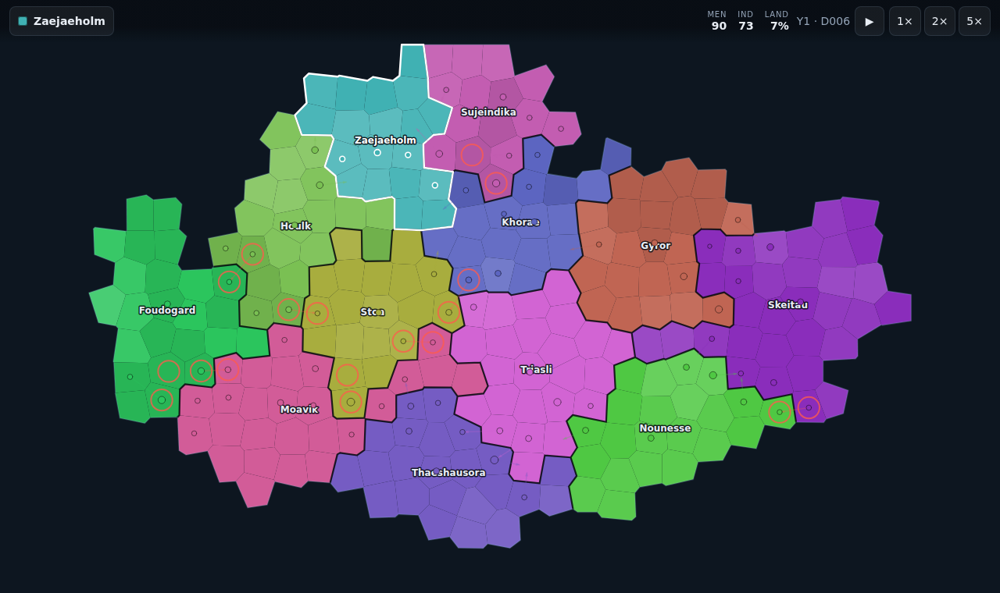
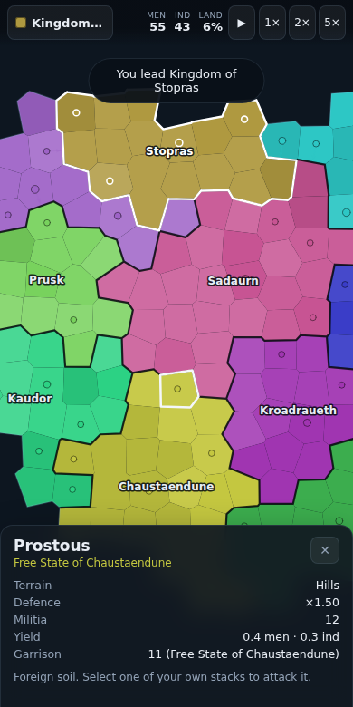

# Province Conquest

A minimalist province-capturing strategy game that runs entirely in the browser.
The core loop of a grand-strategy game — own provinces, raise armies, take
ground — with the historical content, tech trees and supply chains stripped out.

Every world is procedurally generated: the map, the nations, their names, colours
and starting borders all come from a seed. There is no backend; the whole game is
static files.





## Running it

```bash
npm install
npm run dev      # development server
npm run build    # production bundle into dist/
npm run preview  # serve the built bundle
```

Checks:

```bash
npm run typecheck
npm test         # unit tests (vitest)
npm run e2e      # browser tests, desktop + mobile (playwright)
```

`npm run e2e` needs a build first — it serves `dist/` via `vite preview`.

## How to play

You lead one nation on a continent of a dozen. Everyone is permanently at war
with everyone; there is no diplomacy to manage.

- **Select** a province by tapping or clicking it.
- **Give orders** by selecting one of your provinces that holds a stack, then
  tapping a bordering province. The bordering provinces you can march into are
  outlined with a dashed line. That is the whole order system — the same two taps
  work with a mouse or a thumb, and there is no mode to switch.
- **Recruit** from the details panel. It costs manpower and industry and is
  instant; there is no build queue.
- **Win** by holding 60% of the land, or by being the last nation standing. Lose
  your last province and the game is over.

Keyboard, on desktop: `space` pauses, `1`/`2`/`3` set speed, `esc` clears the
selection, arrows or `WASD` pan, `+`/`-` zoom.

Your game autosaves to `localStorage` and can be resumed from the start screen.
A save stores the seed and the mutable state, not the map — geometry is a pure
function of the seed, so it is regenerated on load.

## How it works

### Generating a world

`src/game/mapgen.ts` runs a fixed pipeline, all of it driven by one seeded PRNG:

1. A jittered grid of points, relaxed twice with Lloyd's algorithm so the Voronoi
   cells come out evenly sized rather than as slivers.
2. Elevation from fractal value noise, pulled down towards the edges of the map
   so a single continent forms with an irregular coast. Sea level is chosen as a
   quantile of the scores, which fixes the land fraction regardless of seed.
3. **Only the largest connected landmass is kept.** That guarantees every nation
   is reachable overland, which is what lets the game skip navies, transports and
   naval combat entirely.
4. Terrain from two more noise fields, independent of the coastline.
5. Nations grown outward from well-separated seeds, one province at a time, in
   round-robin. A plain multi-source Dijkstra lets whichever nation starts in
   open country run away with half the continent; round-robin keeps sizes
   comparable, while a per-nation appetite and jittered edge costs keep the
   borders varied and organic.
6. Names from a syllable generator, and colours from a golden-angle hue walk with
   a fixup pass that pushes apart any *neighbouring* pair that landed too close.

### Simulating

`src/game/sim.ts` advances the world one day at a time, in a fixed order:
economy, AI, movement, combat, attrition, victory. One day is 600ms at 1×.

Two rules do most of the balancing work:

- **Provinces defend themselves.** Every province has a militia an attacker has
  to beat. Without it most of the map is empty and conquest is just walking, so
  expansion would be paced by marching speed rather than by economy.
- **Occupied territory is worth little.** Conquered provinces yield 28% of their
  output and their militia is halved, so a large empire of occupied land is
  brittle. This is deliberately anti-snowball.

Only one army stack can occupy a province. That single constraint removes stack
management, unit types and army lists, and it is what makes the tap-tap order
system unambiguous.

### Rendering

`src/render/renderer.ts` draws in two layers. The base — sea, province fills,
borders — is expensive but changes rarely, so it is cached in an offscreen canvas
and redrawn only when the camera moves or a province changes hands. Everything
that animates goes over the top each frame.

The base is re-rendered *from vectors* at the current zoom rather than being a
scaled-up world texture, so it stays sharp at every zoom level; a 2× world
texture would be ~54MB, which is far too heavy for a phone. Viewport culling
keeps zoomed-in redraws cheap, and the backing store is capped at 2× device pixel
ratio for fill rate.

National borders are drawn only along edges where ownership actually changes.
Voronoi neighbours share exact vertices, so `buildBorderEdges` matches each
polygon edge to the province on either side once per world; stroking whole
polygons instead would double-draw every shared edge.

Hit testing (`src/render/picking.ts`) renders each province in a colour encoding
its id into an offscreen canvas, once per world. Selecting a province is then a
single pixel read rather than a point-in-polygon scan over hundreds of shapes.

### Layout

```
src/core/     seeded RNG and noise, polygon maths, colour maths
src/game/     types, config, map generation, simulation, AI, save format
src/render/   camera, renderer, colour-index picking, palette
src/ui/       pointer input, HUD, screens, localStorage
```

`src/core/` and `src/game/` never touch `document` or `window`, which is what
makes map generation and the whole simulation testable headlessly.

## Tuning

Every balance number lives in `src/game/config.ts` — province count, nation
count, day length, yields, militia strength, combat and march rates, and the
victory threshold. Nothing is tuned anywhere else.

As shipped, a game runs roughly 500–900 simulated days, about 6–8 minutes at 1×
and proportionally less at higher speeds. `tests/playthrough.test.ts` measures
this by playing whole games headlessly; it also asserts that every game reaches a
decision, that both endings are reachable, and that no nation is structurally
favoured. Note that the "player" in those tests is the same simple AI the
opponents use, so the win rates it reports are a floor rather than a target.
